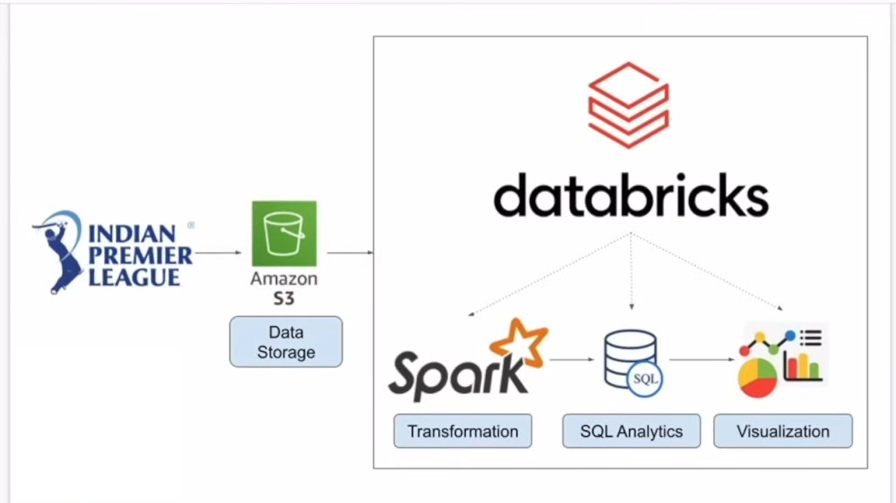

# Indian Premier League Cricket Data Analysis with Databricks and Spark

## 📌 Project Overview
This project focuses on building an end-to-end data pipeline for analyzing Indian Premier League (IPL) cricket data.  

## 🏗️ Architecture

- **Amazon S3** for data storage
- **Databricks** for data processing
- **Apache Spark** for transformations
- **SQL** for analytics
- **Matplotlib and Seaborn** for insights

I aim to demonstrate a modern cloud-based data platform using Databricks and Spark to perform scalable transformations and interactive SQL queries on IPL data.

---

## 📂 Dataset

- **Source**: [IPL Data – data.world](https://data.world/raghu543/ipl-data-till-2017)
- **Description**:  
  Includes data on matches, players, deliveries, and other aspects from the IPL seasons up to 2017.

---

## 📄 Project Files

| File | Description |
| :--- | :--- |
| `cricket_data_analysis_spark.ipynb` | Databricks/Spark notebook containing data ingestion, transformation, analysis, and visualization steps |
| `Architecture.png` | High-level system architecture for the project |

---

## 🛠️ Key Components

- **Data Storage**: IPL match and player data stored in S3 buckets
- **Spark Transformations**: Cleaning, joining, and aggregating raw datasets using PySpark
- **SQL Analytics**: Writing SQL queries on transformed data for insights (e.g., top players, team performances)
- **Visualization**: Creating visual reports from aggregated metrics

---

## 🚀 How to Run

1. Upload the `cricket_data_analysis_spark.ipynb` notebook to your Databricks workspace.
2. Set up a cluster with **Apache Spark** runtime.
3. Connect to your **S3 bucket** containing the IPL datasets.
4. Update any file paths in the notebook if necessary.
5. Run the notebook cells to:
   - Load data
   - Perform transformations
   - Execute SQL queries
   - Visualize results

---

## 📋 Requirements

- Databricks account
- Access to an Amazon S3 bucket
- Spark 3.x runtime
- Python 3.x
- Basic understanding of PySpark and SQL

---

## 👤 Author

- **Divyansh Prakhar Soni** – [GitHub Profile](https://github.com/divyanshsoni2)

